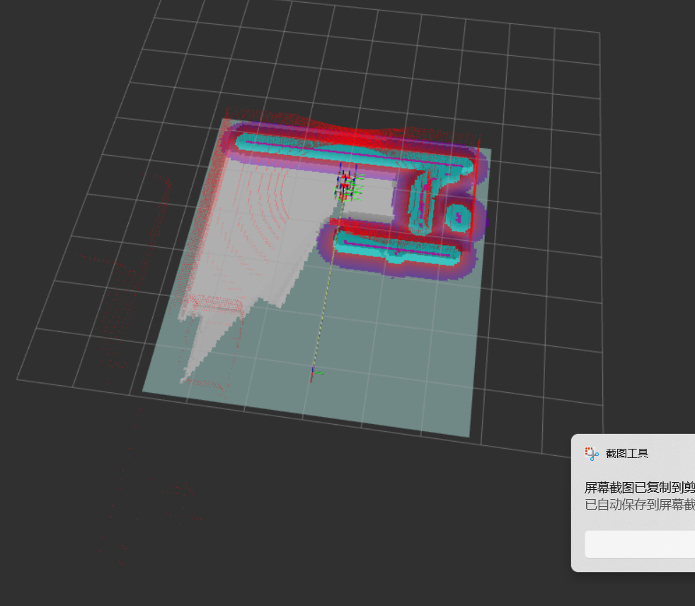

使用champ开源算法,实现智元机器狗d1的ign-gazebo仿真和导航
===
## 配置环境依赖

- 安装依赖
```bash
sudo apt install ros-humble-gazebo-ros2-control
sudo apt install ros-humble-xacro
sudo apt install ros-humble-robot-localization
sudo apt install ros-humble-ros2-controllers
sudo apt install ros-humble-ros2-control
sudo apt install ros-humble-velodyne
sudo apt install ros-humble-velodyne-gazebo-plugins
sudo apt-get install ros-humble-velodyne-description
```
## 使用方式
- ign_gazebo节点 + 导航(包含cartographer)
```bash
ros2 launch sim_ign_dog d1_gazebo_sim_dog.launch.py 
```
> 考虑到稳定性启动的问题,按依赖启动耗时较长(预计10s),请耐心等待;如启动失败请调节urdf中的激光雷达线束数量
- [urdf 第1019行](src/sim_dog/edu_description/urdf/edu.urdf)


- 控制节点(没必要,除非需要手动控制机器狗)
```bash
ros2 run teleop_twist_keyboard teleop_twist_keyboard
```

## 参考仓库
- [anujjain-dev/unitree-go2-ros2](https://github.com/anujjain-dev/unitree-go2-ros2.git)

- [chvmp/champ](https://github.com/chvmp/champ.git)

- [代码实现思路参考](https://github.com/chiway-luo/ign_robot_dog/tree/ign_robot_dog_Agibot)

## 开发参考
- 基坐标系 base_link
- 雷达坐标系 laser_up

## 整体启动顺序总结
```bash
- Gazebo 仿真环境 （house_add.sdf）
- 机器狗 URDF 发布 （ /robot_description ）
- 2 秒后 ：在 Gazebo 生成 d1_dog 实体
- 同时 ：ROS↔GZ 桥接、RViz2、各种静态 TF
- 4 秒后 ：启动 joint_state_broadcaster
- jsb_spawner 退出后 ：自动启动 legs_controller
- legs_spawner 退出 + 1 秒后 ：启动 CHAMP 步态控制
- 最后 ：启动 Nav2 导航
```
